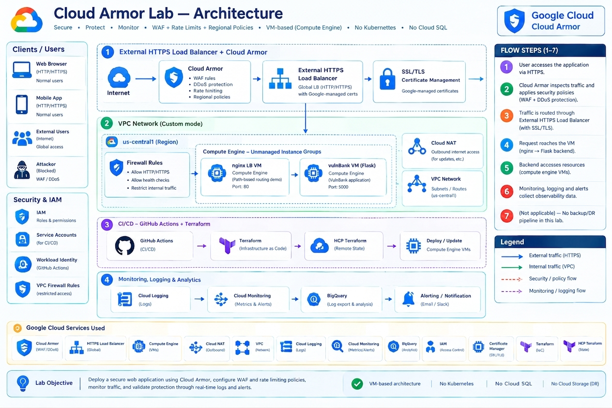

<div align="center">

# 🛡️ gcp-cloud-armor-waf-ddos-lab

### Cloud Armor WAF & DDoS Protection · Terraform · Live Attack Testing · Real Findings, Not Just Docs

[](https://www.terraform.io)
[](https://cloud.google.com/armor)
[](https://github.com/features/actions)
[](https://cloud.google.com/iam/docs/workload-identity-federation)
[](.github/workflows/security-regression.yml)

*A hands-on GCP Cloud Armor lab — WAF, rate limiting, bot mitigation, regional and edge policy precedence, monitoring, and CI/CD — built against a live, deliberately vulnerable banking app. Every capability below was actually attacked, tested, and confirmed against real infrastructure, not assumed from documentation. Where testing corrected an initial assumption or caught a real bug, that's called out explicitly, because that's the part worth reading if you're evaluating Cloud Armor for real.*

</div>

---

## 📋 Table of Contents

- [Overview](#-overview)
- [Why Cloud Armor](#-why-cloud-armor--the-actual-case-for-it)
- [Architecture](#-architecture)
- [Repo Structure](#-repo-structure)
- [Capabilities — Tested vs. Documented-Only](#-capabilities--tested-vs-documented-only)
- [Real Findings — Not Just a Feature Tour](#-real-findings--not-just-a-feature-tour)
- [The Recurring Bug Class](#-the-recurring-bug-class)
- [CI/CD Pipeline](#️-cicd-pipeline)
- [Monitoring, Logging & Incident Response](#-monitoring-logging--incident-response)
- [Complete Tech & Tool Inventory](#-complete-tech--tool-inventory)
- [Testing](#-testing)
- [Multi-Environment Structure](#-multi-environment-structure)
- [Known Limitations](#️-known-limitations)
- [Prerequisites & Getting Started](#-prerequisites--getting-started)
- [Teardown](#-teardown)
- [Vulnerable App](#-vulnerable-app)
- [Repository](#-repository)

---

## 🌐 Overview

This project answers one question end to end: **what does Cloud Armor actually do when you point real attacks at it, not simulated ones?**

It isn't a tutorial repo that shows the happy path. It's a working lab where SQL injection, XSS, brute-force login attempts, geo-spoofed traffic, and TLS-fingerprint evasion were all tried for real against a live, deliberately vulnerable banking app sitting behind Cloud Armor — and where several initial assumptions about how specific settings behave turned out to be wrong, corrected only by testing against real infrastructure and real logs.

### 🔑 Key Facts

| Property | Value |
|---|---|
| 🏗️ **IaC Engine** | Terraform, real `plan` / `apply` / `destroy` against live GCP |
| ☁️ **Cloud Platform** | Google Cloud Platform (Cloud Armor Standard tier, no Enterprise subscription) |
| 🎯 **Target App** | [`Commando-X/vuln-bank`](https://github.com/Commando-X/vuln-bank) — a real, deliberately vulnerable banking web app, pinned as a git submodule |
| 🔐 **Auth** | Workload Identity Federation for CI/CD — zero service account key files |
| 🧪 **Testing** | Automated daily security regression suite against live endpoints — already caught a real regression on its first run |
| 📊 **Monitoring** | Cloud Monitoring alert policies (deny-rate spike, policy-change detection) + BigQuery log export |
| 📦 **CI/CD** | GitHub Actions — plan/apply/destroy workflows, all genuinely working end to end |
| 📝 **Docs** | Every `rules-*.tf` file's comments carry the real evidence (log excerpts, error messages) behind that capability's confirmed behavior |

### ✨ What It Does

| Capability | Description |
|---|---|
| 🧱 **WAF protection, live-tested** | OWASP preconfigured SQLi/XSS rules, confirmed blocking 4 distinct real payload shapes and a real stored-XSS exploit against the app's own documented vulnerability |
| 🚦 **Rate limiting & bot mitigation** | IP throttle/ban and JA3/JA4 TLS-fingerprint keying, confirmed via real browser-vs-curl split tests |
| 🌍 **Access control** | IP/CIDR, ASN, and geo-blocking — geo-blocking confirmed with a real request from an actual `us-central1` VM, not simulated |
| 🏛️ **Policy architecture, precedence tested** | Backend, regional, and edge security policies — confirmed edge-layer denies win before the backend policy is even evaluated |
| 🔁 **Redirect & challenge actions** | External 302 confirmed working; reCAPTCHA Enterprise confirmed **inert** without an actual Enterprise key — stronger than the documented caveat |
| 🩺 **Preview mode, confirmed via logs** | A rule in preview mode logs what it would have done (`previewSecurityPolicy`) without enforcing it |
| 🤖 **Automated regression testing** | Runs daily against live endpoints; already caught a real, previously-unnoticed regression on its first run |
| 📡 **Monitoring & alerting** | Deny-rate-spike and policy-change alert policies, wired to a real email notification channel |
| 📈 **BigQuery log export** | All LB/Cloud Armor logs exported for analysis beyond ad-hoc `gcloud logging read` queries |
| ⚙️ **Working CI/CD** | GitHub Actions + Terraform + HCP Terraform + WIF, genuinely functional after finding and fixing 6 real integration bugs |

---

## 💡 Why Cloud Armor — the actual case for it

Having tested this hands-on rather than just read the docs:

- **Blocks real attacks before they reach your app.** Confirmed with live SQL injection and stored-XSS payloads against a real vulnerable banking app — Cloud Armor stopped every one at the edge, with zero input validation on the app's own side.
- **Rate limiting and bot mitigation without touching app code.** Brute-force login attempts and scripted abuse get throttled or banned at the load balancer, confirmed with real threshold tests, before reaching any database or business logic.
- **Defense in depth, evaluated in layers, confirmed independently.** An edge-layer deny wins even when a backend-layer default-allow exists — a misconfigured backend policy doesn't automatically expose you if the edge layer is doing its job.
- **Real investigative visibility.** Every enforcement decision logs enough detail (which rule, which field matched, TLS fingerprints, geo/ASN) to actually diagnose an incident — every finding in this repo was diagnosed using exactly these logs, nothing more.
- **It also has real, non-obvious failure modes — and this repo shows where they are.** A misconfigured WAF sensitivity level blocked *legitimate* user registration outright in testing here. Knowing that failure mode before hitting it in production is arguably as valuable as the attack-blocking demos themselves.

---

## 🏛️ Architecture



```
                    Internet
                       │
        ┌──────────────┴──────────────┐
        ▼                             ▼
  nginx-lab.<domain>          vulnbank-lab.<domain>
  (Google-managed cert)       (Google-managed cert, IPv6 frontend)
        │                             │
   nginx-https-proxy          vulnbank-https-proxy
        │                             │
   nginx-backend  ◄── shared ──►  vulnbank-backend
        │         Cloud Armor          │
        │       (lab-baseline-policy)  │
        ▼                             ▼
  nginx VM (path-demo)     vulnbank VM (Flask, :5000)
                          Commando-X/vuln-bank, pinned commit

  Cloud Armor policy layers (confirmed via real testing):
    Edge policy      ──► evaluated FIRST, independently of backend
    Backend policy   ──► WAF, rate-limit, IP/geo/redirect rules
    Regional policy  ──► separate policy type, own regional LB required

  Cross-cutting (always-on):
    Cloud Monitoring  ── deny-rate-spike + policy-change alerts
    BigQuery export   ── all LB/Cloud Armor logs
    Daily regression  ── scripts/security-regression-tests.sh via Actions
```

### 🔄 What's Actually Live vs. What Was Temporary

| Component | Status |
|---|---|
| `lab-baseline-policy` + both LBs | **Live** — the actively deployed environment this whole project tested against |
| Regional backend security policy demo | **Torn down** — built and tested end to end on a temporary regional LB stack, confirmed working, removed after |
| Edge-vs-backend precedence demo | **Torn down** — same pattern, confirmed via real log evidence, removed after |
| Monitoring, BigQuery export | **Live** — wired into the actual `lab` environment |
| `staging` environment | **Not yet applied** — a ready-to-use template, deliberately not deployed to avoid tripling cost for a single-operator lab |

---

## 🗂️ Repo Structure

```
gcp-cloud-armor-waf-ddos-lab/
├── .gitmodules                       # vulnerable-app pinned to Commando-X/vuln-bank @ <commit-hash>
├── terraform/
│   ├── modules/
│   │   ├── compute/                  # nginx VM template + vuln-bank VM (Flask app on :5000)
│   │   ├── instance-groups/          # unmanaged IGs, multi-region
│   │   ├── load-balancer/
│   │   │   ├── https-lb/             # HTTPS LB, backend services, URL map
│   │   │   └── network-lb/           # passthrough Network LB — Advanced Network DDoS + Network Edge policy demos
│   │   ├── cloud-armor/              # security policies: backend + edge + regional
│   │   │   ├── backend-policies/
│   │   │   ├── edge-policies/
│   │   │   ├── network-edge-policies/    # L3/L4 protection for passthrough Network LBs
│   │   │   └── hierarchical-policies/    # org/folder-level policy enforcement
│   │   ├── address-groups/           # org-scoped reusable IP/CIDR lists
│   │   ├── monitoring/               # Cloud Monitoring alert policies + notification channel
│   │   └── log-export/               # BigQuery sink for LB/Cloud Armor logs
│   ├── environments/
│   │   ├── README.md                 # multi-environment promotion workflow
│   │   ├── lab/
│   │   │   ├── main.tf
│   │   │   ├── variables.tf
│   │   │   ├── monitoring.tf         # wires monitoring + log-export modules into the live lab env
│   │   │   └── backend.tf            # HCP Terraform remote state
│   │   └── staging/                  # NOT YET APPLIED — clean reference environment template,
│   │                                 # confirmed-safe config only, monitoring/log-export wired in
│   └── policies/
│       ├── rules-baseline.tf         # default deny-all, allow-all, priorities
│       ├── rules-ip-based.tf         # allow/deny by IP, ASN
│       ├── rules-ip-based-ipv6.tf    # same allow/deny pattern, IPv6 CIDR variant
│       ├── rules-user-ip-header.tf   # evaluate original client IP behind another proxy/CDN
│       ├── rules-address-groups.tf   # reusable IP/CIDR lists referenced across policies
│       ├── rules-geo-based.tf        # region blocking
│       ├── rules-path-based.tf       # CEL path expressions (/goodpath, /badpath)
│       ├── rules-rate-limit.tf       # throttle + rate-based ban on vuln-bank /login, /transfer (app has no native rate limiting)
│       ├── rules-rate-limit-ja4.tf   # rate limit by JA4 TLS fingerprint
│       ├── rules-rate-limit-ja3.tf   # rate limit by JA3 TLS fingerprint
│       ├── rules-redirect.tf         # reCAPTCHA Enterprise + external 302
│       ├── rules-preconfigured-waf.tf    # OWASP sqli-stable, xss-stable; one-line CVE canary note
│       ├── rules-waf-tuning.tf       # sensitivity levels (paranoia 0–4), signature opt-out, field/header/cookie exclusions
│       ├── rules-threat-intelligence.tf  # evaluateThreatIntelligence() — Enterprise
│       ├── rules-logging-modes.tf    # NORMAL vs VERBOSE logging on one existing rule
│       ├── rules-preview-test.tf     # preview mode — logs a would-be match without enforcing
│       ├── rules-xff-ip-test.tf      # XFF_IP rate-limit keying investigation, kept as empty list
│       └── hierarchical-org-policy.tf    # applied at folder, tested for inheritance
├── .github/workflows/
│   ├── terraform-plan.yml            # PR: plan + post as comment
│   ├── terraform-apply.yml           # manual dispatch: apply to lab env
│   ├── terraform-destroy.yml         # manual dispatch: teardown (cost control)
│   └── security-regression.yml       # daily automated regression run against live endpoints
├── scripts/
│   ├── security-regression-tests.sh  # the suite security-regression.yml runs
│   ├── build-push-vulnbank-image.ps1 # normalizes line endings in a temp copy, never touches
│   │                                 # the pinned submodule
│   └── demos/
│       ├── 01-baseline-deny-allow.sh
│       ├── 02-ip-allow-deny.sh
│       ├── 02b-ipv6-allow-deny.sh
│       ├── 03-address-groups.sh
│       ├── 04-path-based-rules.sh
│       ├── 05-throttle-vs-ban.sh         # target vuln-bank /login and /transfer
│       ├── 06-ja4-rate-limit.sh
│       ├── 06b-ja3-rate-limit.sh
│       ├── 07-geo-asn-blocking.sh
│       ├── 08-hierarchical-policy.sh
│       ├── 09-vulnbank-sqli-xss.sh       # SQLi on /login (& biller queries), XSS on feedback/profile field, blocked by preconfigured WAF
│       ├── 10-user-ip-header.sh
│       ├── 11-logging-modes.sh
│       ├── 12-waf-tuning-false-positive.sh   # false positive: apostrophe in a legit transaction/biller name trips sqli-stable; fix via sensitivity + field exclusion
│       ├── 13-redirect.sh
│       └── xff-ip-test.sh
├── vulnerable-app/                   # git submodule → Commando-X/vuln-bank (MIT), pinned to fixed commit
│   └── NOTES.md                      # commit hash pinned; AI chat agent left disabled (DEEPSEEK_API_KEY unset, mock-mode not routed); out of scope for this lab
├── docs/
│   ├── architecture.md
│   ├── standard-vs-enterprise.md
│   ├── cicd-setup.md                 # the full CI/CD debugging journey — 6 real bugs, all fixed
│   ├── incident-response-runbook.md  # attack vs. false-positive triage, grounded in real findings
│   ├── dashboard-queries/            # example BigQuery SQL for a Looker Studio dashboard
│   │   ├── README.md
│   │   ├── top-blocked-ips.sql
│   │   ├── sqli-attempts-over-time.sql
│   │   └── denies-by-rule-priority.sql
│   ├── enterprise-features/
│   │   ├── adaptive-protection.md
│   │   ├── threat-intelligence.md
│   │   ├── advanced-network-ddos.md
│   │   ├── bot-management-tokens.md
│   │   ├── ddos-attack-visibility.md
│   │   └── scc-integration.md        # SCC findings: Allowed traffic spike, Increasing deny ratio
│   ├── alternate-backends/
│   │   ├── serverless-neg.md
│   │   └── gke-ingress-backendconfig.md
│   ├── service-mesh-rate-limiting.md
│   ├── iam-least-privilege.md         # least-privilege roles for the GitHub Actions service account
│   ├── pricing-cost-awareness.md      # per-policy/per-rule/per-forwarding-rule billing + Enterprise subscription
│   └── screenshots/
├── README.md                          # includes upstream vuln-bank disclaimer: isolated env only, no real data, don't expose beyond this lab
└── SECURITY-NOTICE.md                 # repeats vuln-bank's own warning, since it's now sitting behind a public GCP LB for demo purposes
```

---

## 🎯 Capabilities — Tested vs. Documented-Only

| Capability | Status | Real Evidence |
|---|---|---|
| SQLi (OWASP preconfigured) | ✅ Tested | 4 distinct real payload shapes, 4 different CRS rule IDs caught (`942100`, `942180`, `942190`, `942200`) |
| XSS (OWASP preconfigured) | ✅ Tested | Real stored-XSS payload against vuln-bank's documented bio-field vulnerability, blocked |
| WAF sensitivity tuning | ✅ Tested | Sensitivity 2 confirmed to block **all new user registration** — a real severity-critical false positive |
| Field-level WAF exclusions | ✅ Tested | Confirmed it fixes one endpoint while **silently disabling protection on another** sharing the same field name |
| Rate limiting (throttle/ban) | ✅ Tested | Real threshold tests, confirmed via log `rateLimitAction.outcome` |
| JA3/JA4 TLS fingerprinting | ✅ Tested | Real browser-vs-curl split test — independent rate-limit buckets confirmed |
| IP/ASN allow-deny | ✅ Tested | Denied own real IP, confirmed via log |
| Geo-blocking | ✅ Tested | Real request from an actual `us-central1`-origin VM, correctly denied |
| IPv6 | ⚠️ Partial | Provisioned and reachable in principle; this network lacks outbound IPv6 for full end-to-end proof |
| `user_ip_request_headers` | ✅ Tested, corrected | Does **not** affect `origin.ip`/`origin.asn`/plain IP rules; **does** affect rate-limit `XFF_IP` keying — narrower scope than initially assumed |
| Redirect: external 302 | ✅ Tested | Confirmed working via real `Location` header |
| Redirect: reCAPTCHA Enterprise | ✅ Tested, corrected | Confirmed **inert** without an actual Enterprise key — stronger finding than "won't render a challenge" |
| Preview mode | ✅ Tested | Confirmed via a distinct `previewSecurityPolicy` log field |
| Backend security policies | ✅ Tested | The default, most-exercised policy type in this repo |
| Regional security policies | ✅ Tested | Full regional LB stack built and torn down; `google-beta` provider + `capacity_scaler` requirements confirmed |
| Edge security policies & precedence | ✅ Tested | Edge deny confirmed to win before backend policy is even evaluated |
| Logging verbosity (NORMAL vs VERBOSE) | ✅ Tested, corrected | **No observable difference found** — corrected the original documentation assumption |
| Address groups | ⛔ Documented only | Requires Cloud Armor Enterprise, confirmed via a real API error, not just docs |
| Threat Intelligence | ⛔ Documented only | Requires Cloud Armor Enterprise |
| Adaptive Protection | ⛔ Documented only | Requires Cloud Armor Enterprise |
| Hierarchical (org/folder) policies | ⛔ Documented only | Module exists; applying it needs org-admin access not exercised here |

---

## 🔍 Real Findings — Not Just a Feature Tour

Every row here is a genuine bug found, or a genuine assumption corrected, by testing against real infrastructure.

| Real Issue Hit | Root Cause | Fix |
|---|---|---|
| Every Cloud Armor rule was silently bypassed | An allow-all rule at priority 10 beat every WAF/rate-limit/path rule, since it was evaluated first | Removed it; added a real baseline-allow at priority 9000, below all real rules |
| Zero logs despite real denied traffic | `log_level` on the policy doesn't generate logs by itself — the backend service's own `log_config.enable` was never set | Added `log_config { enable = true }` to the backend service |
| Backend went "unconditional drop overload" after a VM rebuild | Unmanaged instance groups silently lose membership when their VM is replaced; Terraform doesn't detect the drift | Manually re-added the VM to its instance group; documented as a known gotcha |
| WAF sensitivity 2 blocked all new signups | Sensitivity 2's broader SQLi coverage came with a severe false positive on ordinary registration input | Locked in sensitivity 1 as the shipped default, backed by the real test evidence |
| A field exclusion "fixed" one endpoint | Excluding the `username` field from WAF inspection also disabled SQLi protection on a *different* endpoint sharing that field name | Documented as a real risk; not shipped as the default approach |
| `user_ip_request_headers` seemed to do nothing | Assumed it would make IP-match/CEL rules trust a spoofed header — it doesn't | Isolated testing found the real scope: rate-limit `XFF_IP` keying only |
| A "would-be" rate-limit test kept failing unexpectedly | JA4's rule and the IP-based ban rule both matched `/transfer`, and the lower-priority-number rule always won, masking the other | Gave JA4 its own dedicated path, isolated from the collision |
| An external-302 redirect stopped firing with no code change nearby | Retargeting JA4 to root path `/` created a *new*, unrelated collision with the redirect rule also matching `/` | Caught automatically by the regression suite on its first scheduled run; gave the redirect its own dedicated path too |
| GitHub Actions failed with "token not found" | Per-step `env:` blocks don't persist to later steps in GitHub Actions | Moved `env:` to job level |
| `terraform plan` hung forever in CI | Local execution mode doesn't auto-inject HCP Terraform workspace variables; no `terraform.tfvars` exists in a fresh CI checkout | Passed `TF_VAR_*` explicitly from repository variables, added `-input=false` as a fail-fast safety net |
| CI failed with "could not find default credentials" | Nothing in the workflow ever authenticated to GCP itself — a separate concern from the HCP Terraform token | Built Workload Identity Federation (this org blocks service account key creation entirely) |
| CI failed with a 403 on IAM resources | Resource-specific admin roles (`compute.admin`, etc.) don't include permission to manage *other* service accounts' IAM bindings | Granted `roles/resourcemanager.projectIamAdmin` explicitly |
| A Monitoring alert policy repeatedly failed to create | Assumed `resource.type="global"`, then `"http_load_balancer"` — both wrong | Queried the Monitoring API directly for a real time series; found the correct type, `l7_lb_rule` |
| BigQuery dataset creation rejected a plain integer | `default_table_expiration_ms` appears to enforce an int32-range ceiling in this provider version, even though the real API supports int64 | Used a value safely under the ~24.8-day ceiling (2^31 ms) |

---

## 🔁 The Recurring Bug Class

The single most-repeated finding in this project: **two rate-limit/action rules matching overlapping or unconditional traffic on one path always have exactly one that actually matters** — whichever sits at the lower priority number — and fixing one collision can silently create a new one elsewhere.

| # | Collision |
|---|---|
| 1 | Priority-10 allow-all vs. every real rule in the policy |
| 2 | reCAPTCHA challenge rule vs. the `/login` rate-limit rule |
| 3 | JA4 fingerprint rule vs. the IP-based ban rule, both on `/transfer` |
| 4 | JA4 (after being moved to root `/`) vs. the external-302 redirect rule — caught automatically by the regression suite, not by manual review |

The durable fix applied throughout: give every rate-limit/redirect/challenge rule its own dedicated, non-overlapping path rather than relying on priority ordering alone.

---

## ⚙️ CI/CD Pipeline

| Workflow | Trigger | Purpose |
|---|---|---|
| `terraform-plan.yml` | Every PR touching `terraform/**` | Plans the lab environment, posts the plan as a PR comment |
| `terraform-apply.yml` | Manual dispatch, typed confirmation required | Applies to the lab environment |
| `terraform-destroy.yml` | Manual dispatch, exact project-ID confirmation required | Tears down the lab environment |
| `security-regression.yml` | Daily cron + manual dispatch | Runs `scripts/security-regression-tests.sh` against live endpoints — already caught a real regression on its first run |

- **Workload Identity Federation** — every workflow authenticates to GCP via short-lived OIDC tokens scoped to this exact repository. No service account key file has ever existed (this org's policy blocks key creation outright).
- Getting CI/CD working end to end surfaced **six distinct real bugs** (see the findings table above) — the full, honest debugging account is in [`docs/cicd-setup.md`](docs/cicd-setup.md).

---

## 📡 Monitoring, Logging & Incident Response

| Component | What It Does |
|---|---|
| **Deny-rate-spike alert** | Fires when Cloud Armor denies exceed a threshold within a window, summed across both backend services |
| **Policy-change alert** | Fires on any Cloud Armor security policy mutation (rule added/removed/changed), sourced from the Admin Activity audit log |
| **Email notification channel** | Both alerts route here — configurable via `notification_email` |
| **BigQuery log export** | All LB/Cloud Armor logs exported for analysis beyond ad-hoc `gcloud logging read` queries |
| **Example dashboard queries** | [`docs/dashboard-queries/`](docs/dashboard-queries/) — top blocked IPs, SQLi attempts over time, denies by rule priority; a starting point for a Looker Studio dashboard |
| **Incident response runbook** | [`docs/incident-response-runbook.md`](docs/incident-response-runbook.md) — how to tell a real attack from a false positive, live mitigation options, rollback steps, all grounded in this project's own confirmed findings above |

---

## 🧰 Complete Tech & Tool Inventory

### Core IaC
| Tool | Purpose |
|---|---|
| Terraform | Primary IaC engine |
| HCL | Terraform's configuration language |
| HCP Terraform | Remote state storage (Local execution mode — see `docs/cicd-setup.md` for why) |

### Google Cloud Services
| Service | Used For |
|---|---|
| Cloud Armor (Standard tier) | WAF, rate limiting, IP/geo/ASN rules, redirects, backend/regional/edge policies |
| Compute Engine | nginx + vuln-bank VMs, unmanaged instance groups |
| Cloud Load Balancing | Global HTTPS LB (self-signed or Google-managed cert), regional external LB (temporary demo) |
| Certificate Manager (Google-managed SSL) | Trusted HTTPS on real subdomains |
| Cloud NAT | Outbound internet for VMs with no external IP |
| IAM (incl. Workload Identity Federation) | All CI/CD authentication, VM service accounts |
| Cloud Logging | All Cloud Armor / LB request logs, audit logs |
| Cloud Monitoring | Alert policies, notification channels, log-based metrics |
| BigQuery | Log export destination, example analysis queries |
| Artifact Registry | Pinned vuln-bank container image |
| reCAPTCHA Enterprise API | Enabled for the redirect-rule demo (confirmed inert without a real key) |

### CI/CD & Automation
| Tool / Action | Purpose |
|---|---|
| GitHub Actions | All CI/CD orchestration |
| `google-github-actions/auth` | WIF-based GCP authentication in CI |
| `hashicorp/setup-terraform` | Installs Terraform in CI runners |
| `actions/checkout` | Repo checkout in every job |
| `actions/github-script` | Posts Terraform plan output as a PR comment |
| GitHub CLI (`gh`) | Far more reliable than the web UI for reading Actions logs during debugging |

### Languages & Scripting
| Language | Where Used |
|---|---|
| Bash | All demo scripts, the automated regression suite, CI shell steps |
| PowerShell | Local development workflow (Windows) |
| SQL | BigQuery dashboard example queries |
| Python (Flask) | The vuln-bank target application |
| YAML | GitHub Actions workflow definitions |
| Markdown | All documentation |

---

## 🧪 Testing

- **`scripts/security-regression-tests.sh`** — asserts real HTTP responses against live endpoints for baseline traffic, path-based rules, SQLi, XSS, rate-limiting, and redirects
- **Runs daily via `security-regression.yml`**, plus on manual dispatch
- **Already proved its value**: on its first real run, it caught the JA4-vs-redirect collision (finding #4 in the recurring-bug-class table above) — a regression that had gone unnoticed until the automated check existed
- Manual demo scripts (`scripts/demos/`) cover capabilities that don't suit automated CI well — geo-blocking needs a real non-local origin, reCAPTCHA needs a real browser, JA3/JA4 needs a genuinely different TLS client

---

## 🗂️ Multi-Environment Structure

```
terraform/environments/
├── lab/        # ACTIVELY DEPLOYED — this project's live test sandbox
└── staging/    # NOT YET APPLIED — a clean reference environment: same
                # modules, only the confirmed-safe shipped config, with
                # monitoring/log-export wired in from the start
```

`staging` and a documented `prod` pattern exist as ready-to-use templates, deliberately not deployed — standing up two more full copies of this infrastructure would roughly double or triple real cost for a single-operator lab with no actual second set of users. See [`terraform/environments/README.md`](terraform/environments/README.md) for the full promotion workflow.

---

## ⚠️ Known Limitations

- **No Cloud Armor Enterprise subscription** — Adaptive Protection, Threat Intelligence, Advanced Network DDoS, DDoS Attack Visibility, SCC integration, and Address Group enforcement are documented in [`docs/enterprise-features/`](docs/enterprise-features/) from public documentation only, clearly marked as not independently verified here
- **Hierarchical (org/folder) policies** — the module exists and is documented, but applying it against a real org hierarchy needs org-admin access not exercised end to end in this project
- **IPv6 not fully end-to-end verified** — provisioned and reachable in principle; this development network lacks outbound IPv6
- **`staging`/`prod` environments not deployed** — deliberate cost decision for a single-operator lab; the structure and promotion workflow are the real deliverable
- **Looker Studio dashboard not built** — BigQuery export and example queries exist; wiring an actual dashboard is a manual UI step left for whoever needs it

---

## 🚀 Prerequisites & Getting Started

- A GCP project with billing enabled
- Terraform >= 1.3
- An HCP Terraform workspace, set to **Local** execution mode (Remote mode can't resolve this repo's relative module paths — confirmed the hard way)
- `gcloud` CLI authenticated
- A domain you control, if you want trusted HTTPS (self-signed works without one)
- For CI/CD: Workload Identity Federation configured against your GCP project — see [`docs/cicd-setup.md`](docs/cicd-setup.md) for the exact commands

```bash
git clone --recurse-submodules https://github.com/bikram-singh/gcp-cloud-armor-waf-ddos-lab.git
cd gcp-cloud-armor-waf-ddos-lab

# Copy and fill in terraform/environments/lab/terraform.tfvars (gitignored)
# with your project_id, vulnbank_image_tag, and notification_email.

cd terraform/environments/lab
terraform init
terraform plan
```

Or trigger `terraform-apply.yml` from the Actions tab once CI/CD is configured.

---

## 🧹 Teardown

```bash
cd terraform/environments/lab
terraform destroy
```

Or trigger `terraform-destroy.yml` from the Actions tab (requires typing the exact project ID to confirm).

**Remember**: the vulnerable app attracts real internet scanning traffic the moment it's reachable on a public domain — confirmed within the same session it went live. Don't leave it running longer than you're actively testing. See [`docs/pricing-cost-awareness.md`](docs/pricing-cost-awareness.md) for what's actually billing while this runs.

---

## 🎯 Vulnerable App

The SQLi/XSS/rate-limit demos target [`Commando-X/vuln-bank`](https://github.com/Commando-X/vuln-bank) (MIT licensed), included as a pinned git submodule — see [`vulnerable-app/NOTES.md`](vulnerable-app/NOTES.md) for the pinned commit. Its AI chat agent is intentionally left disabled — out of scope for a Cloud Armor lab.

> ⚠️ **Security notice:** this repo deploys an intentionally vulnerable application behind a public GCP Load Balancer for demonstration purposes. See [`SECURITY-NOTICE.md`](SECURITY-NOTICE.md) before deploying anything in this repo to a real project.

---

## 🔗 Repository

| Repository | Purpose |
|---|---|
| [`gcp-cloud-armor-waf-ddos-lab`](https://github.com/bikram-singh/gcp-cloud-armor-waf-ddos-lab) | Cloud Armor WAF & DDoS Protection Lab — Terraform · Live Testing · Real Findings |

---

<div align="center">

**Maintained by Bikram Singh**

*Built with Terraform · Google Cloud Armor · GitHub Actions · Workload Identity Federation*

</div>
