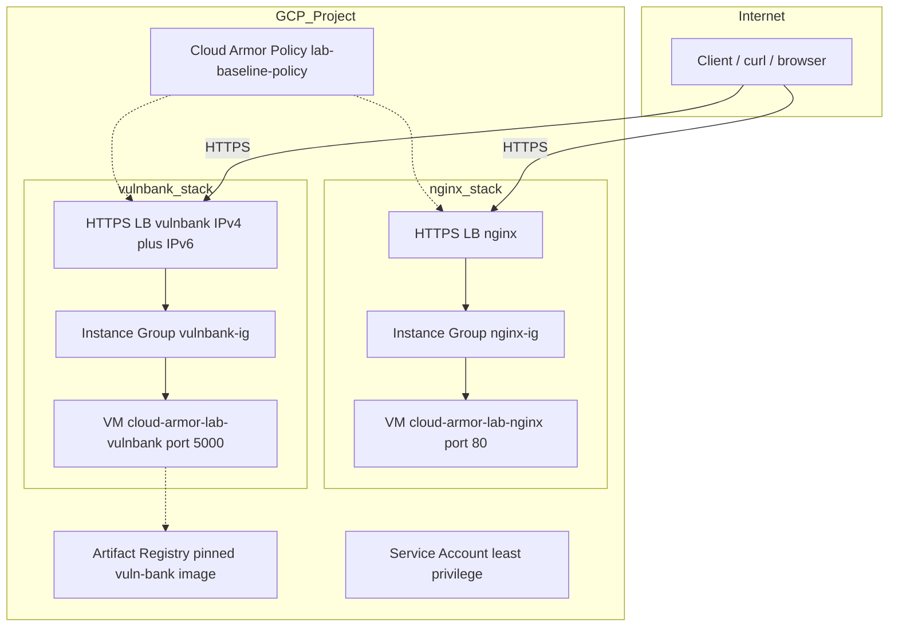

# Architecture

## Overview

This lab provisions two independent, side-by-side applications behind
their own HTTPS Load Balancers, both protected by the same Cloud Armor
backend security policy, letting one policy demonstrate every capability
across two different real workloads (a static nginx backend for
path-based demos, and the vuln-bank Flask app for SQLi/XSS/rate-limit
demos).

Diagram (Mermaid) is appended below by the next command.

## Why two separate LBs, not one with path routing

vuln-bank expects to own the root path (/login, /transfer, /graphql,
etc.). Routing both apps through one URL map with path-based rules would
risk path collisions between vuln-bank's own routes and nginx's
/goodpath, /badpath demo content. Two LBs (two external IPs) avoids
this entirely, at the cost of your demo scripts and article needing to
reference two addresses instead of one.

## Where Cloud Armor actually filters

Cloud Armor rules match against a request before it reaches either LB's
URL map routing or backend. This matters for the path-based demo
specifically: /goodpath and /badpath are not GCP URL-map routes, they
are plain content served by nginx at those paths, and Cloud Armor's own
CEL rule (request.path.matches(...)) decides allow/deny at the
security-policy layer, independent of how the LB itself would route
those paths.


## Self-signed TLS

Both LBs generate their own self-signed certificate via the tls
provider at apply time (see modules/load-balancer/https-lb/main.tf),
there is no real domain for this lab, so a Google-managed cert is not
applicable. Every demo script's curl calls use -k to skip certificate
verification accordingly.

## What is NOT yet in this architecture

- Hierarchical policies (org/folder-level) - stub module, not built
  (see modules/cloud-armor/hierarchical-policies/README.md)
- Network Edge policies (L3/L4 for passthrough Network LBs) - stub
  module, not built, and this lab has no passthrough Network LB to attach
  it to anyway (both LBs here are Application/HTTPS LBs)
- Multi-region instance groups - environments/lab/variables.tf
  defines a secondary_region variable, but nothing currently uses it.
  The geo-blocking demo (07-geo-asn-blocking.sh) works around this by
  documenting a temporary VM approach instead

## Component diagram



## Terraform module dependency order

environments/lab
  - google_project_service (API enablement)
  - google_compute_network + subnetwork + firewall
  - module.compute (Artifact Registry, service account, 2 VMs)
  - module.instance_groups (depends on compute)
  - module.policies (independent - just rule-list locals/outputs)
  - module.baseline_policy (depends on policies)
  - module.trusted_ips (address-groups, independent)
  - module.lb_nginx / module.lb_vulnbank (depends on instance_groups and baseline_policy)

## Known gotcha: unmanaged instance groups after VM replacement

If a VM in this lab is ever destroyed and recreated (Terraform replace,
manual `gcloud compute instances delete` + recreate, etc.), its
unmanaged instance group can end up with ZERO members afterward, even
though Terraform's `google_compute_instance_group.instances` argument
shows no diff (same VM name/self_link string, so Terraform sees nothing
to change). The backend service then reports no healthy backends, and
the LB returns a generic "unconditional drop overload" response --
this is a Google Front End / Envoy-level message meaning zero available
backends, not a Cloud Armor block.

Confirmed hit during this project's real first deploy: the nginx VM was
replaced (via `terraform apply` after a startup-script fix), and its
instance group silently emptied out.

**Fix:**
```powershell
gcloud compute instance-groups unmanaged add-instances <group-name> \
  --zone=<zone> --project=<project> --instances=<vm-name>
```
Then confirm with:
```powershell
gcloud compute backend-services get-health <backend-name> --global --project=<project>
```
Wait ~1-2 minutes for the health check to flip to `HEALTHY` after
re-adding.

**Why this doesn't get caught by `terraform plan`:** Terraform's diff
is based on the *configured* value of the `instances` list, not the
group's actual current membership as GCP sees it. Since the VM's
self_link is identical after replacement, Terraform believes nothing
changed and won't re-apply the membership.
